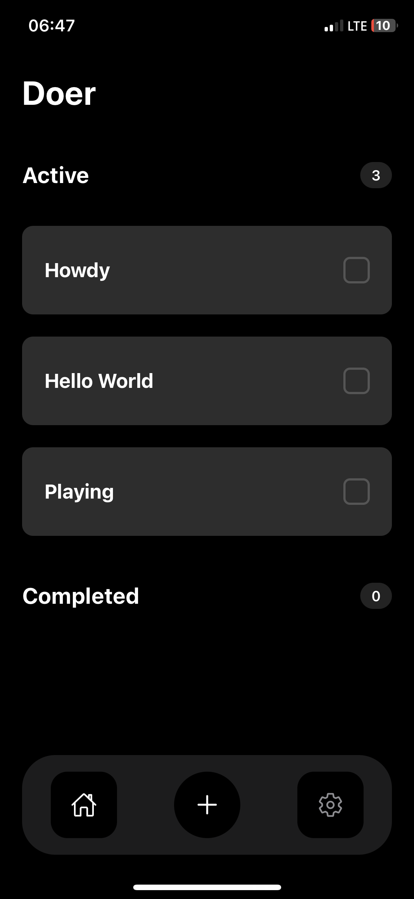
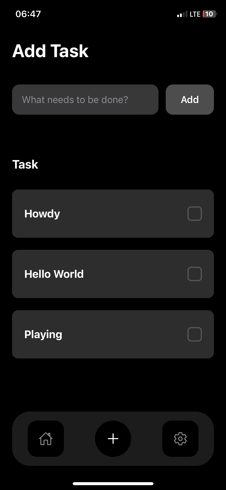
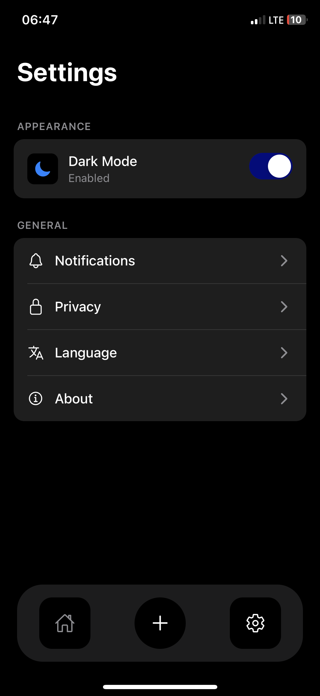
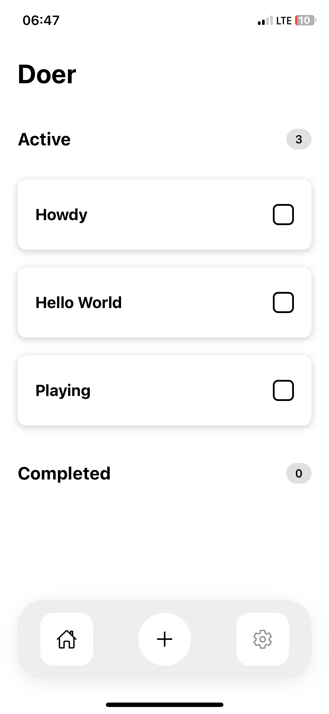
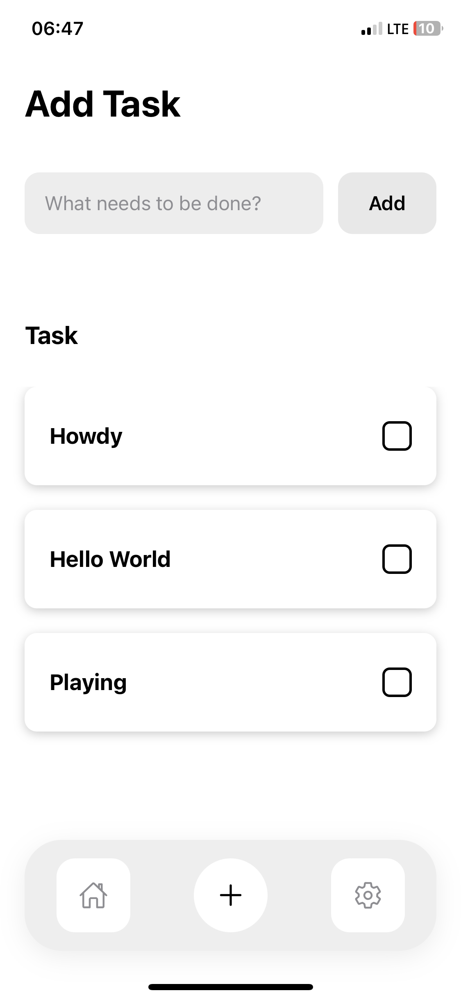
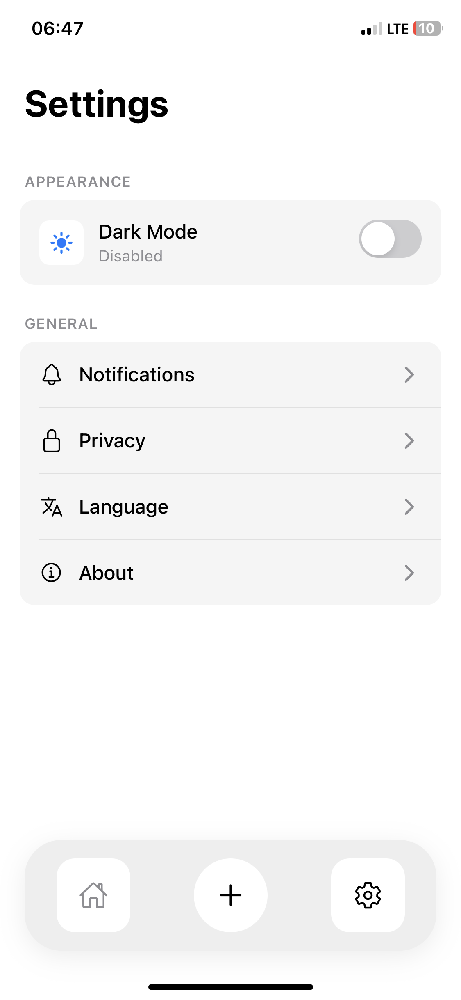

Doer - A Simple Todo App
A clean and minimal todo application built with React Native and Expo, featuring dark/light mode support and persistent storage with Convex.
Screenshots
Dark Mode

<p align="center">
  
  
  
</p>
Light Mode
<p align="center">
  
  
  
</p>
Features

✅ Create, complete, and manage tasks
🌓 Dark/Light mode support
📱 Clean, native mobile UI
💾 Persistent storage with Convex backend
⚡ Real-time updates
🎨 Modern, minimalist design

Tech Stack

Framework: React Native with Expo
Backend: Convex
Language: TypeScript
State Management: React Hooks
Styling: StyleSheet (custom theme system)

# Project Structure

```
Doer-app/
├── app
│   ├── (tabs)
│   │   ├── _layout.tsx
│   │   ├── AddTaskScreen.tsx
│   │   ├── index.tsx
│   │   └── SettingScreen.tsx
│   └── _layout.tsx
├── assets
│   ├── images
│   │   ├── android-icon-background.png
│   │   ├── android-icon-foreground.png
│   │   ├── android-icon-monochrome.png
│   │   ├── favicon.png
│   │   ├── icon.png
│   │   ├── IMG_8467.PNG
│   │   ├── IMG_8468.PNG
│   │   ├── IMG_8469.PNG
│   │   ├── IMG_8470.PNG
│   │   ├── IMG_8471.PNG
│   │   ├── IMG_8472.PNG
│   │   ├── partial-react-logo.png
│   │   ├── react-logo.png
│   │   ├── react-logo@2x.png
│   │   ├── react-logo@3x.png
│   │   └── splash-icon.png
│   └── styles
│       ├── addTask.tsx
│       ├── bottomNav.ts.tsx
│       ├── emptyState.tsx
│       ├── home.ts.tsx
│       ├── input.tsx
│       ├── LoadingStyle.tsx
│       ├── modalStyle.tsx
│       ├── settings.ts.tsx
│       └── todoItem.tsx
├── components
│   ├── BottomNavBar.tsx
│   ├── EmptyState.tsx
│   ├── Header.tsx
│   ├── Input.tsx
│   ├── LoadingSpinner.tsx
│   ├── TodoItem.tsx
│   └── TodoModal.tsx
├── convex
│   ├── _generated
│   │   ├── api.d.ts
│   │   ├── api.js
│   │   ├── dataModel.d.ts
│   │   ├── server.d.ts
│   │   └── server.js
│   ├── README.md
│   ├── schema.ts
│   ├── todos.ts
│   └── tsconfig.json
├── hooks
│   └── useTheme.tsx
├── app.json
├── eslint.config.js
├── package-lock.json
├── package.json
├── q
├── README.md
└── tsconfig.json
```

Getting Started
Prerequisites

Node.js (v16 or higher)
npm or yarn
Expo CLI
Convex account

Installation

Clone the repository:

bashgit clone <your-repo-url>
cd Doer-app

Install dependencies:

bashnpm install

Set up Convex:

bashnpx convex dev

Start the development server:

bashnpx expo start

Run on your device:

Scan the QR code with Expo Go app (iOS/Android)
Press i for iOS simulator
Press a for Android emulator

Usage
Adding a Task

Tap the "+" button in the bottom navigation
Enter your task description
Tap "Add" to create the task

Completing a Task

Tap the checkbox next to any task to mark it as complete
Completed tasks move to the "Completed" section

Settings

Access the settings screen via the gear icon
Toggle between dark and light mode
Configure notifications, privacy, and language preferences

Key Components

TodoItem: Individual task display with checkbox
EmptyState: Placeholder when no tasks exist
BottomNavBar: Navigation between Home, Add Task, and Settings
useTheme: Custom hook for managing app theme

Backend Schema
The app uses Convex for data persistence with the following schema:
typescripttodos: {
text: string,
isCompleted: boolean,
createdAt: number
}
Available Scripts

npm start - Start the Expo development server
npm run android - Run on Android emulator
npm run ios - Run on iOS simulator
npm run web - Run in web browser
npx convex dev - Start Convex backend development server

Contributing
Contributions are welcome! Please feel free to submit a Pull Request.

Fork the repository
Create your feature branch (git checkout -b feature/AmazingFeature)
Commit your changes (git commit -m 'Add some AmazingFeature')
Push to the branch (git push origin feature/AmazingFeature)
Open a Pull Request

License
This project is open source and available under the MIT License.
Contact
For questions or feedback, please open an issue on GitHub.

Built with ❤️ using React Native and Convex
